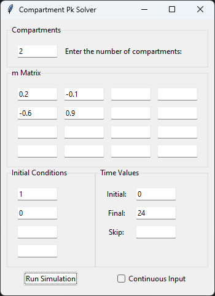
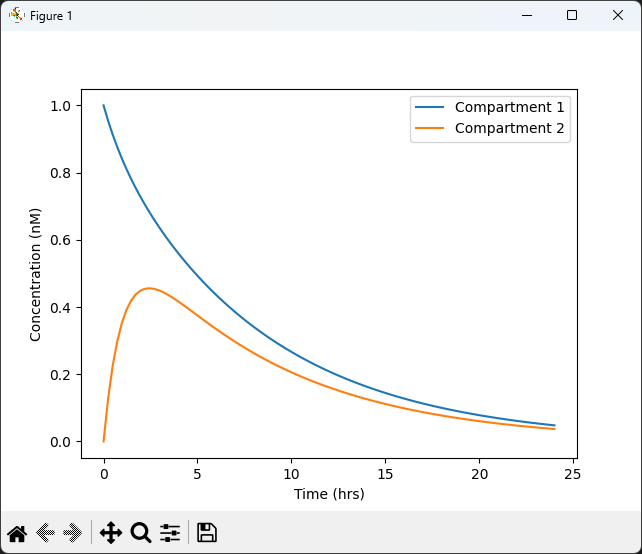
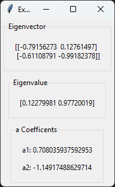

# CompartmentPk Solver

Compartment ODE solver is a tool focused in solving molecule transfer between compartments problems that are part of the University of Utah BME 4001 - bioTransport class. In using this tool known data can be entered to create a concentration vs time plot and solve for additional data values. This program is designed to solve compartment ODE's in the form:

$$ \frac{d\vec{C}}{dt} + \overline{m}\,\vec{C} = \vec{F} \tag {1} $$

and will output a concentration vs time plot. The m matrix ($\,\overline{m}\,$) is a ratio of the concentration coefficents ($\,k_{ij}\,$) and compartment volumes ($\,V\,$) in the form $n \times n$ matrix in the form:

$$
\overline{m} =
\begin{bmatrix}
m_{11} & m_{12} & m_{13} & m_{14}\\
m_{21} & m_{22} & m_{23} & m_{24}\\
m_{31} & m_{32} & m_{33} & m_{34}\\
m_{41} & m_{42} & m_{43} & m_{44}\\
\end{bmatrix}
\tag {2}
$$

The constants $a_n$ and $\alpha_n$ values in the equation:

$$ C(t) = a_1 e^{-\alpha_1 t} + a_2 e^{-\alpha_2 t} + ... + a_n e^{\alpha_n t} \tag {3} $$

Eigenvalues and eigenvectors additionally solved and are populated in the extra data window with the $a_n$ and $\alpha_n$ values.

Required Modules:
<br/>

[](https://numpy.org/)
[](https://scipy.org/)
[](https://sympy.org)
[](https://matplotlib.org/)
[](https://docs.python.org/3/library/tkinter.html)

## Usage

### Terminal

Launch python program from ther terminal with:

```
python comp_ODE_solver.py
```

Terminal must be active in the same directory as the python program to launch.

### Windows

For windows users a compiled app is availible [here](https://github.com/BattlemasterLoL/CompartmentPk/releases). The program may also be launched using ther terminal command above.

### macOS

For macOS users a compiled app is availible [here](https://github.com/BattlemasterLoL/CompartmentPk/releases). The program may also be launched using ther terminal command above.

### Linux

For linux users a compiled app is not avalible and muse be lunched using there terminal outlined above.

## Documentation

After the program has been launced a window will open (this may take a few seconds to apear). The window consists of three primary sections: Compartments, m Matrix, and Initial Conditions. This is then followed by the button Run Simulation.

### Compartments

This section of the program has a single box to enter the number of compartments the problem consists of. The number of compartments this program is able to hande ranges from 2 compartments to 4 compartments.

### m Matrix

This section of the program consists of a $4 \times 4$ grid of boxes to enter numarical values. The number of rows and columns to be used is determined by the number of compartments entered in the prevous section. Values entered into the box must be numarical and can consist of desimal values as well as positive and negative numbers. Values entered bust start at the upper left entry box and will be assosiated with the $m_{11}$ value of the m matrix. If the number of compartments is less than 4 you do not need to enter values into the extra boxes.

### Initial Conditions

This section of the program consists of 4 boxes to enter the values of the known initial conditions of each of the compartments. These values must be numarical and may contain desimal values. The order of the initial condition boxes are with the top being the first compartment and assinding in order as you move down. If the number of compartments is less than 4 you do not need to enter values into the extra boxes. If the continuous input box is checked the initial conditions of each compartment is set to 0 and these inputs will be for the input over time for each compartment.

### Time Settings

This secion of the program consists of 3 boxes to enter the start time, end time, and time between input (skip) of molecules into compartments. The start time or initial is the time value where the plot time will begin. The end time or final is where the plot time will end. If multiple inputs of molecules is not occuring leave the skip box blank.

### Continuous Input

Next to the run simulation button is a checkbox (default off) for continuous input. When this box is pressed the program will simulate a continuous input over time. This changes the initial conditions section input to be the continuous input over time conditions for each compartment. This causes the initial conditions to be set to 0 for all compartments.

### Run Simulation

This button is to be pressed after all values in the previous sections are filled out. By pressing this putton the ODE will be solved for time values set in the time setting section and a plot will be created in a new window. This plot may then be saved by pressing the save icon in the plot window (see plot example below). An additional window will be generated containing the eigenvectors, eigenvalues and a coefficents for equation 2 and 3 as outlined above.

## Examples

|               <h3>Main Program</h3>                |              <h3>Plot</h3>              |        <h3>Eigen & Constants Data</h3>        |
| :------------------------------------------------: | :-------------------------------------: | :-------------------------------------------: |
|  |  |  |
